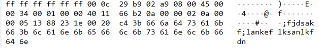
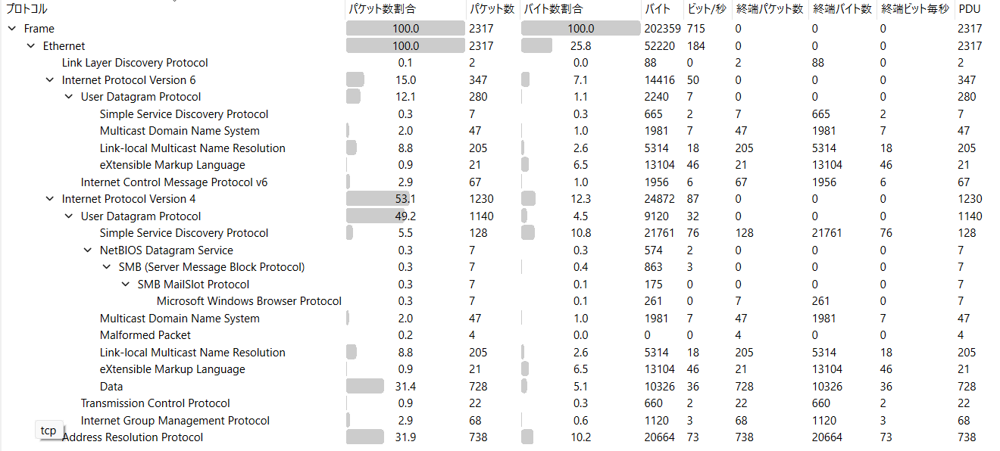

# shark on wire 1
[shark on wire 1](https://learn.cylabacademy.org/library/30?page=1&search=shark+on)

## writeup

### 1
まず、```shark-on-wire-1-capture.pcap```をWiresharkで開く。
PCAPとは、ネットワーク上で送受信されたパケットを記録したファイルである。

### 2
Wiresharkの表示フィルタに以下を入力する。
udp
**なぜUDPか？**


### 3
UDPパケットを確認すると、以下のような情報がある。
```
Source Port
Destination Port
Length
Checksum
```
この中でも、今回はDestinaition Port(宛先ポート)に注目する。
調べていくと、```8888```ポートを使用している。
そこで次のフィルタを使用する。
udp.dstport == 8888
これによって、
UDPで宛先ポート8888に送られた通信だけを表示することができる。

### 4
```udp.dstport == 8888```で絞り込んだパケットを確認する。
パケットを選択し、Packet Details からUDPを展開すると、Dataを確認できる。
ここで、パケットごとに文字データが入っていることがわかる。
つまり、
```
パケット1 → 1文字目
パケット2 → 2文字目
パケット3 → 3文字目
...
```
というように、複数のパケットを使って文字列を送信していると考えられる。

### 5
```udp.dstport == 8888```だけでは、複数の宛先に送られた通信が表示される。そこで、Destination IPを確認する。
Flagが送られている通信の宛先IPに絞るため、
以下のようなフィルタを使用する。
```udp.dstport == 8888 && ip.dst == 10.0.0.12```
これによって、
UDP → 宛先ポート8888 → 宛先IP 10.0.0.12
という条件を満たす通信だけを見ることができる。

### 6
残ったパケットのDataを、パケットの順番に確認するとflagが得られる。

## 学び


これはWiresharkのパケットバイトの表示だね。
簡単に言うと、**ネットワークパケットを16進数と文字にして表示しているもの**です。

今回の画像を左から見ていくと、こんな構造になっています。
### 1
```ff ff ff ff ff ff ```
これは宛先MACアドレス。
MACアドレスとは、ネットワークインターフェースに割り当てられる識別子です。
ですが今回のMACアドレスは普通のではないです。
これはブロードキャストMACアドレスです。
**同じLANにいる全員に送るといういみです。**

### 2.送信元MACアドレス
```00 0c 29 b9 02 a9```
これは送信元MACアドレスです。
文字通り送信元の機器を表すアドレス。

### 3.IPアドレス
MACアドレスの次に、今度はIPアドレスが登場する。
上の画像では```45 00 00 4f ...```
からIPv4ヘッダが始まっている。(IPv4 = IPという通信ルールのバージョン4)

IPv4では、
```
Source IP
Destination IP
```
という情報を持っています。

**MACとIPの違い**
|MACアドレス|この機器は誰？|
|IPアドレス|この機器はネットワーク上のどこ？|

### 4.ポート番号
同じネットワーク内の機器のどの通信に届けるのかを表すもの。
私はこれだけじゃピンとこないのでここに具体例を書く。

1台のPCでWebサーバーとSSHサーバーが同時に動いてるとする。
別のPCから、**Webページを見たい場合**
```192.168.1.10 : 80```
にデータを送る。
これは、つまり、
**192.168.1.10というPCの、80番ポートで待っているWebの通信に届けて！**となる。

**SSHで接続したい場合**
```192.168.1.10 : 22```に送る。
今度は、
**192.168.1.10というPCの、22番ポートで待っているSSHの通信に届けて！**となる。

### 5.その他


```統計 → プロトコル階層```を開くと、今開いているpcapファイルのプロトコル階層を見ることができる。
上の画像でどの部分を見ればいいかを書きます。なぜなら僕は初心者だから

**一番見るべきなのはパケット数**
一回何が何なのかわからないから上から順に書き出してみる。
|プロトコル|内容|
|---|---|
|Frame|Wiresharkが記録した1回分のデータ|
|Ethernet|LAN内でデータを送るための通信規格|
|Link Layer Discovery Protocol|ネットワーク機器同士が、自分の情報を知らせるためのプロトコル|
|Internet Protocol Version 6|IPv6アドレスを使って通信するための仕組み|
|User Datagram Protocol|データを素早く送る通信方式|
|Simple Service Discovery Protocol|ネットワーク上の機器やサービスを探すためのプロトコル|
|Multicast Domain Name System|同じネットワーク内で機器名などの名前解決する仕組み|
|Link-local Multicast Name Resolution|同じネットワーク内でコンピュータ名をIPアドレスに変換するための仕組み|
|eXtensible Markup Language|データを構造化して表現するための形式|
|Internet Control Message Protocol v6|IPv6の通信状態の確認やエラー通知などに使われるプロトコル|
|Internet Protocol Version 4|IPv4アドレスを使って通信するための仕組み|
|User Datagram Protocol|データを素早く送る通信方式|
|NetBIOS Datagram Service|ネットワーク上の機器やサービスを探すためのプロトコル|
|SMB (Server Message Block Protocol)|Windowsネットワークなどでデータグラムを送るための仕組み|
|SMB MailSlot Protocol|ファイルやプリンターなどをネットワーク越しに共有するためのプロトコル|
|Microsoft Windows Browser Protocol|Windowsネットワーク上のコンピュータを発見するためのプロトコル|
|Multicast Domain Name System|同じネットワーク内で機器名などを名前解決する仕組み|
|Malformed Packet|正常な形式として解析できなかったパケット|
|Link-local Multicast Name Resolution|同じネットワーク内で名前解決を行う仕組み|
|eXtensible Markup Language|データを構造化して表現するための形式|
|Data|特定のプロトコルとして判別できなかったデータ|
|Transmission Control Protocol|データが正しく届いたか確認しながら通信する方式|
|Internet Group Management Protocol|IPv4のマルチキャスト通信を管理するプロトコル|
|Address Resolution Protocol|IPアドレスからMACアドレスを調べるプロトコル|