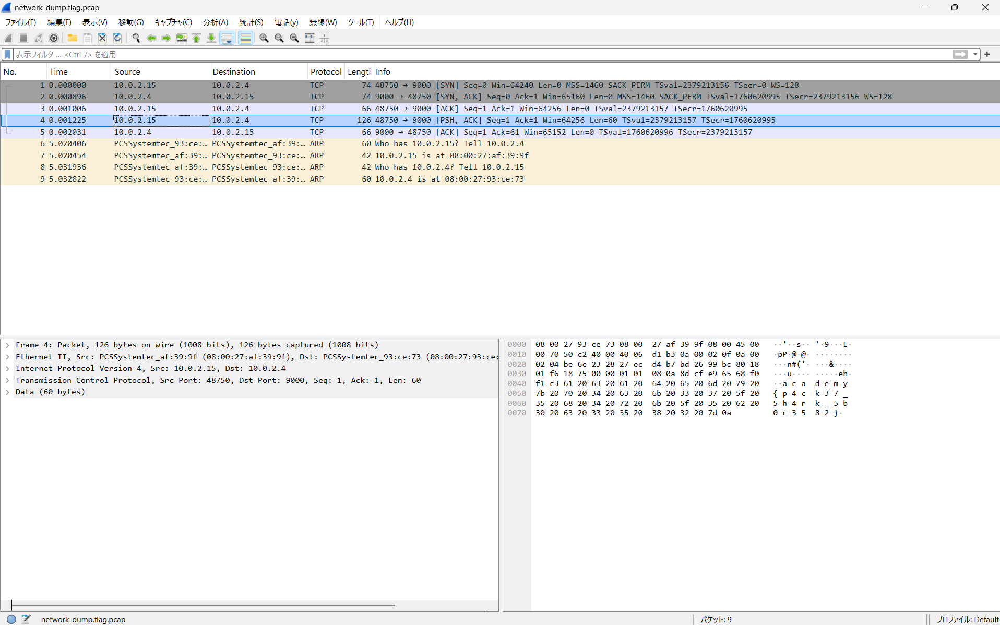
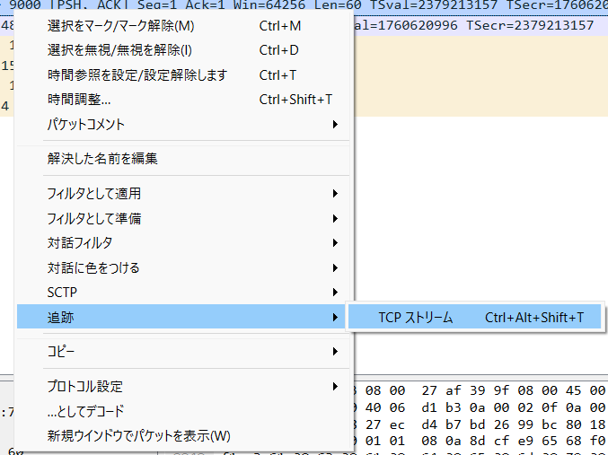
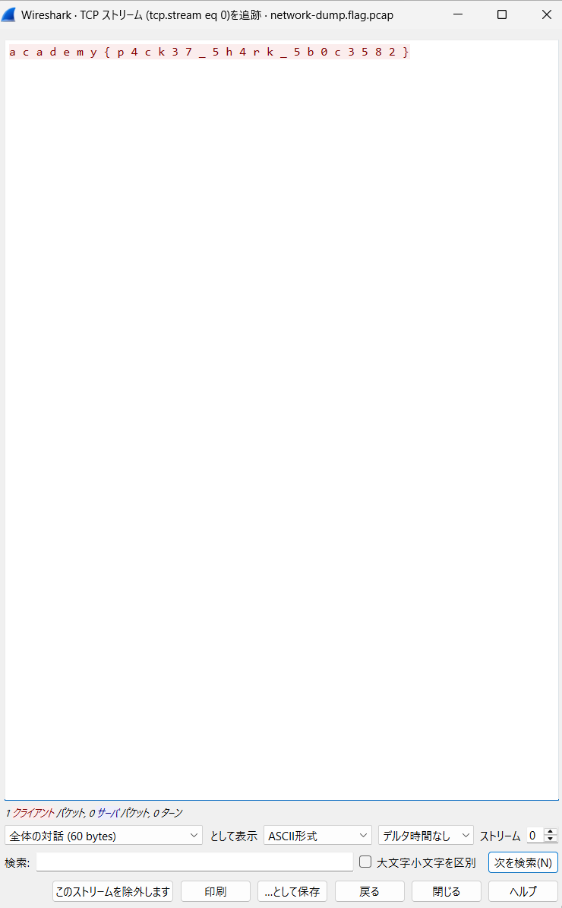

# Packets Primer

## Writeup
[Packers Primer - CyLab Security Academy](https://learn.cylabacademy.org/library/286?page=3&difficulty=2&category=4)

PCAPファイルをWiresharkで解析し、通信データの中に隠されたFlagを見つける問題。

### 1.PCAPファイルをWiresharkで開く
配布された'nerwork-dump.flag.pcap'をWiresharkで開く。
PCAPファイルには、ネットワーク上を流れた通信データが記録されている。

### 2.TCPパケットを調べる
表示されたパケットを確認し、TCP通信に注目する。
TCPの接続を確立するためのハンドシェイクと、実際にデータを送信しているパケットを区別する。

### 3.データ本体を確認する
対象のパケットを選択し、画面下部のパケット詳細やバイト列の表示を確認する。
ASCII欄にFlagの一部と思われる文字列が表示されていることを確認する。

### 4.TCPストリームを確認する
対象のパケットを右クリックし、
'追跡　→　TCPストリーム'
を選択する。
通信内容を確認し、Flagに該当する文字列を読み取る。

## 知識
| 用語 | 内容 |
| PCAP | ネットワーク通信を記録したファイル |
| パケット | ネットワーク上で送受信されるデータの単位 |
| Ethernet | LANなどで使われる通信方式 |
| MACアドレス | ネットワーク機器を識別するアドレス |
| IPアドレス | ネットワーク上の機器を識別するアドレス |
| TCP | データを確実に届けるための通信 |
| ポート番号 | 通信するサービスを識別する番号 |
| ハンドシェイク | TCP通信を開始する前の確認のやり取り |
| TCPストリーム | TCP通信を一連の流れとしてまとめたもの |
| ARP | IPアドレスからMACアドレスを調べるためのプロトコル |
| プロトコル | 通信を行うためのルール |
| TCPフラグ | TCPパケットの役割や状態を示す情報 |
| SYN | TCP通信を開始するときに使われるフラグ |
| ACK | TCP通信で受信を確認するときに使われるフラグ |